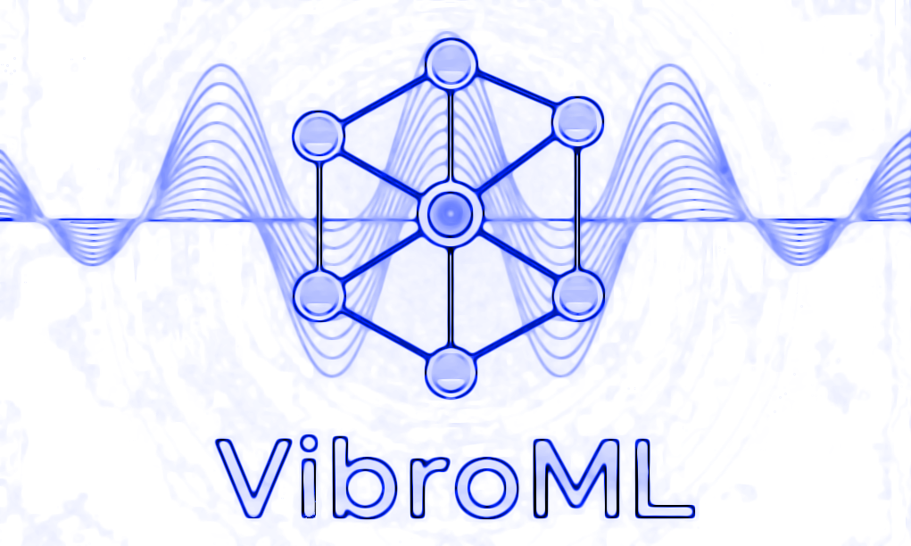

### VibroML
<div align="center">  
  
</div>
<h3 align="center">AI-Powered Vibrational Analysis & Stability Suite</h3>
[](https://pypi.org/project/vibroml/) [](LICENSE)

### Overview

VibroML is a powerful and user-friendly Python toolkit designed for efficient, Machine-Learned Interatomic Potential (MLIP)-driven vibrational analysis of crystalline materials. It streamlines the process of identifying and stabilizing dynamically unstable phases, making it an invaluable tool for materials discovery and design. By leveraging state-of-the-art MLIPs like MACE, VibroML significantly reduces manual intervention, accelerating the discovery of novel, dynamically stable material phases.

### Key Capabilities

VibroML provides an end-to-end workflow to:

*   **Compute Phonon Band Structures & Density of States (DOS):** Extracting vibrational properties.
*   **Screen for Imaginary (Negative) Modes:** Automatically detect dynamically unstable phonon modes.
*   **Automated Soft Mode Displacement & Re-optimization:** Displace atoms along unstable eigenmodes and re-optimize the structure to find lower-energy, stable configurations.
*   **Validate Dynamic Stability:** Utilize MLIP-powered molecular dynamics simulations for robust finite-temperature stability assessment.

### Modes of Operation

VibroML offers several specialized modes to suit different analysis needs:

*   **Phonon-Only Mode:** Quickly compute phonon band structures and DOS, with detailed reporting of imaginary modes. Ideal for initial stability checks.
*   **Auto-Screen Mode:** An intelligent, automated pipeline to detect unstable modes, displace atoms along them, re-optimize the structure, and iteratively stabilize it. This mode includes a parameter sweep to find optimal calculation settings and can trigger various optimization methods.
*   **Soft-Mode Iterative Optimization Methods:**
    *   **Traditional:** Systematic exploration using a predefined grid of displacement scales and cell transformations.
    *   **Traditional-All:** Comprehensive mode swapping where each soft mode pairing explores both configurations (softest as primary + other as secondary, and vice versa) for thorough parameter space exploration.
    *   **Genetic Algorithm (GA):** Evolutionary optimization with mutation, crossover, and selection to intelligently explore the potential energy surface. Recommended for complex searches.
    *   **Random Optimization (opt_random):** Stochastic structure generation with random Cartesian displacements and variable displacement bounds.
*   **Transition State Analysis Methods:**
    *   **NEB (Nudged Elastic Band):** Find minimum energy pathways between initial and final structures using the nudged elastic band method.
    *   **CI-NEB (Climbing Image NEB):** Enhanced NEB method with climbing image technique to accurately locate transition states.
*   **Molecular Dynamics Stability Analysis:** MLIP-based molecular dynamics simulations to assess dynamic stability at finite temperatures with comprehensive stability metrics.
*   **Command-Line Interface (CLI):** Simple and intuitive CLI for high-throughput screening and integration into automated workflows.

### Installation

VibroML can be installed via `pip` or from source.

```bash
# Recommended: Via pip
pip install vibroml

# From source (for development or latest features)
git clone https://github.com/rogeriog/vibroml.git
cd VibroML
pip install -e .
```

**Prerequisites:**

*   Python 3.9+
*   For MACE engine: `pip install mace-torch`
*   Other scientific libraries (ASE, NumPy, Matplotlib, Pymatgen, Spglib) are handled by `pip install vibroml`.

### Quickstart

#### Basic Usage

To run a phonon calculation, you need a CIF file and specify the calculation engine.

```bash
vibroml --cif your_structure.cif --engine mace
```

#### 1. Phonon-Only Mode

This mode performs a single phonon calculation on your structure. It will relax the structure by default, then compute the phonon band structure and DOS, and report any imaginary modes.

```bash
# Run a phonon calculation with MACE, skipping relaxation
vibroml --cif examples/your_material.cif --engine mace --no-relax

# Run with M3GNet, using a 4x4x4 supercell and custom displacement
vibroml --cif examples/another_material.cif --engine m3gnet --supercell "4" --delta 0.02 --units cm-1

# NEW: Use explicit supercell dimensions for anisotropic materials
vibroml --cif layered_material.cif --supercell "2,2,8" --engine mace --delta 0.01 --units THz

# Backward compatibility: old format still works
vibroml --cif examples/another_material.cif --engine m3gnet --supercell_n 4 --delta 0.02 --units cm-1
```

**Output:**

*   `phonon_bs_dos_*.png` and `*.svg`: Plots of the phonon band structure and DOS.
*   `band_structure_energies_*.txt`, `dos_energies_*.txt`, `k_point_distances_*.txt`, `special_k_points_*.txt`: Raw data files.
*   `special_point_analysis.json`: Detailed analysis of frequencies at high-symmetry k-points.
*   `softest_mode_displacements.txt`: Text file detailing the displacements for the most negative phonon mode.
*   `softest_mode_*.traj` and `softest_mode_*.xyz`: ASE trajectory and XYZ files visualizing the softest mode.
*   `initial_settings.json`: Records the command-line arguments used for the run.
*   `relax.traj` and `relax.xyz`: Trajectory of the relaxation process (if not `--no-relax`).
*   `*_relaxed_*.cif`: The relaxed structure CIF file.
*   `initial_symmetry_analysis.txt` and `relaxed_symmetry_analysis.txt`: Symmetry information for initial and relaxed structures.
*   `energy_info.txt`: Summary of energy changes during relaxation.
*   `*_phonon_run_summary.txt`: A comprehensive summary of the phonon run, including energy per atom, k-point path, space group, supercell size, and total atoms.
*   `*_band.yaml`: Phonopy-compatible YAML file (only if `--save-yaml` flag is used).

#### 2. Auto-Screen Mode

This mode automates the search for stable phases. It performs a parameter sweep over supercell sizes, displacement deltas, and force tolerances to find the best settings that minimize negative imaginary phonons. If a soft mode persists after the sweep, it automatically triggers an iterative soft mode displacement and relaxation workflow using the specified optimization method.

```bash
# Run auto-screen with MACE, using the default GA method for soft mode optimization
vibroml --cif examples/unstable_material.cif --engine mace --auto

# Run auto-screen with M3GNet, using the traditional method
vibroml --cif examples/another_unstable.cif --engine m3gnet --auto --fmax 0.0005 --method traditional

# Run auto-screen with comprehensive traditional_all method
vibroml --cif examples/unstable_material.cif --engine mace --auto --method traditional_all

# Run auto-screen with random optimization method
vibroml --cif examples/unstable_material.cif --engine mace --auto --method opt_random

# Use custom output prefix for organized results
vibroml --cif examples/unstable_material.cif --engine mace --auto --output-prefix "my_project"
```

**Output:**

In addition to the phonon-only mode outputs for each tested configuration, this mode will generate:

*   `auto_results.json`: A summary of the parameter sweep results.
*   Method-specific output directories with automatic suffixes:
    *   `*_TRADITIONAL/`, `*_GA/`, `*_TRADITIONAL_ALL/`, `*_OPT_RANDOM/`, `*_NEB/`, `*_CI_NEB/`, `*_MD_STABILITY/`
*   `soft_mode_iter_*/` directories: Each iteration of the soft mode optimization will have its own folder containing:
    *   `supercell_*/`: Subdirectories for each generated supercell variant.
    *   `*_d*.cif` and `*_d*.xyz`: Displaced supercell structures.
    *   `relaxation_summary.txt`: Summary of relaxation for all displaced structures in that folder.
    *   `soft_mode_iter_*_top_structure_*_phonon_analysis/`: Phonon analysis results for the top lowest-energy relaxed structures from that iteration, including their primitive cell CIFs.
    *   `relaxation_summary_iter.txt`: A summary of relaxation results for the current iteration.
*   Comprehensive summaries:
    *   `overall_relaxation_summary.txt`: Consolidated summary of relaxation results across all iterations, sorted by energy.
    *   `overall_ga_summary.txt`: GA-specific comprehensive summary with unique structure identification.
    *   `overall_traditional_all_summary.txt`: Traditional-all method comprehensive summary with all processed structures.
*   Final structure organization: Structure files are copied to phonon analysis directories with softest phonon frequencies included in filenames for better traceability.

#### 3. Soft Mode Optimization Methods

These methods can be run directly or triggered automatically after auto-screen mode:

##### Traditional Method
Systematic grid search through displacement scales and cell transformations:

```bash
# Run traditional soft mode optimization directly
vibroml --cif examples/unstable_material.cif --engine mace --method traditional
```

##### Traditional-All Method
Comprehensive exploration where each soft mode pairing explores both configurations:

```bash
# Run traditional_all method for exhaustive soft mode exploration
vibroml --cif examples/unstable_material.cif --engine mace --method traditional_all
```

##### Genetic Algorithm Method
Evolutionary optimization for intelligent structure exploration:

```bash
# Run GA optimization (default method)
vibroml --cif examples/unstable_material.cif --engine mace --method ga
```

##### Random Optimization Method
Stochastic structure generation with random displacements:

```bash
# Run random optimization method
vibroml --cif examples/unstable_material.cif --engine mace --method opt_random
```

#### 4. Transition State Analysis Methods

##### NEB (Nudged Elastic Band)
Find minimum energy pathways between two structures:

```bash
# Run NEB analysis between initial and final structures
vibroml --cif initial_structure.cif --final_cif final_structure.cif --method neb --engine mace --auto \
         --neb_num_images 10 --neb_spring_constant 5.0 --neb_max_iterations 1000 --neb_force_tolerance 0.01

# Include phonon analysis for NEB path structures (optional)
vibroml --cif initial_structure.cif --final_cif final_structure.cif --method neb --engine mace --auto \
         --with-phonon --neb_num_images 5
```

##### CI-NEB (Climbing Image NEB)
Enhanced NEB with climbing image for accurate transition state location:

```bash
# Run CI-NEB with climbing image starting at iteration 50
vibroml --cif initial_structure.cif --final_cif final_structure.cif --method ci_neb --engine mace --auto \
         --neb_num_images 10 --neb_climbing_start_iteration 50 --with-phonon
```

#### 5. Molecular Dynamics Stability Analysis

Assess dynamic stability using MLIP-based molecular dynamics simulations:

```bash
# Run MD stability analysis at 300K for 10 ps
vibroml --cif structure.cif --method md_stability --engine mace \
         --temp 300 --time 10.0 --supercell-size "2x2x2"

# Custom MD parameters with different conditions
vibroml --cif structure.cif --method md_stability --engine mace \
         --temp 500 --pressure 1.0 --time 20.0 --supercell-size "3x3x3" --equilibration-fraction 0.3
```

**Output for NEB/CI-NEB Methods:**
*   `neb_optimization_results.json`: NEB optimization summary with energies and convergence data
*   `neb_path_*.traj`: ASE trajectory files for the optimized NEB path
*   `neb_energy_profile.png`: Energy profile plot along the reaction coordinate
*   `neb_summary.txt`: Detailed summary of NEB optimization results
*   Phonon analysis directories (if `--with-phonon` is used): Individual phonon analysis for each NEB image

**Output for MD Stability Analysis:**
*   `md_trajectory_production.traj`: Production phase MD trajectory
*   `md_analysis_results.json`: Comprehensive stability analysis results
*   `md_stability_summary.txt`: Human-readable stability assessment
*   `md_plots/`: Directory containing RMSD, volume, and RDF correlation plots
*   `md_log.txt`: Detailed MD simulation log with stress and energy data

#### 6. Advanced Features

##### YAML File Saving
Optionally save Phonopy-compatible YAML files for detailed analysis:

```bash
# Save YAML files during phonon analysis (disabled by default to reduce file size)
vibroml --cif structure.cif --engine mace --save-yaml
```

##### Custom Output Organization
Use custom prefixes for organized output folder naming:

```bash
# Add custom prefix to output folder names
vibroml --cif structure.cif --engine mace --auto --output-prefix "project_alpha"
# Results will be saved in folders like: project_alpha_structure_name_TIMESTAMP_GA/
```

##### Eigenmode Analysis from Existing Data
Load and analyze specific eigenmodes from existing band.yaml files:

```bash
# Load eigenmode from existing band.yaml file
vibroml --cif structure.cif --engine mace --band_yaml_path existing_band.yaml \
         --q "0.5,0,0" --band_idx 2 --displacement 0.1
```

### Key Command-Line Arguments

#### Core Parameters
- `--cif`: Input CIF structure file (required)
- `--engine`: MLIP engine (`mace`, `m3gnet`, `chgnet`)
- `--method`: Optimization method (`ga`, `traditional`, `traditional_all`, `opt_random`, `neb`, `ci_neb`, `md_stability`)
- `--auto`: Enable automatic parameter sweep and optimization
- `--supercell`: Supercell dimensions (`"N"` for cubic or `"Nx,Ny,Nz"` for anisotropic)
- `--delta`: Displacement distance for phonon calculations (default: 0.03 Å)
- `--fmax`: Force tolerance for structure relaxation (default: 0.001 eV/Å)

#### NEB-Specific Parameters
- `--final_cif`: Final structure for NEB methods (required for NEB/CI-NEB)
- `--neb_num_images`: Number of intermediate images (default: 10)
- `--neb_spring_constant`: Spring constant (default: 5.0 eV/Ų)
- `--neb_force_tolerance`: NEB convergence tolerance (default: 0.01 eV/Å)
- `--neb_climbing_start_iteration`: CI-NEB climbing start iteration (default: 50)
- `--with-phonon`: Include phonon analysis for NEB methods (default: off)

#### MD Stability Parameters
- `--temp`: Simulation temperature in Kelvin (default: 300 K)
- `--pressure`: Simulation pressure in GPa (default: 0.0 GPa)
- `--time`: Total simulation time in picoseconds (default: 10.0 ps)
- `--supercell-size`: MD supercell dimensions (default: "2x2x2")
- `--equilibration-fraction`: Equilibration fraction (default: 0.2)

#### Output Control
- `--output-prefix`: Custom prefix for output folder names
- `--save-yaml`: Save Phonopy-compatible YAML files (default: off)
- `--units`: Frequency units (`THz`, `cm-1`, `meV`) (default: THz)

### Command-Line Interface

Use `vibroml --help` to see all available commands and options.

```bash
# General help
vibroml --help

# Method-specific help and examples are shown in the sections above
```

### Available Methods Summary

| Method | Description | Use Case | Key Features |
|--------|-------------|----------|--------------|
| `phonon` | Single phonon calculation | Initial stability screening | Band structure, DOS, imaginary mode detection |
| `traditional` | Grid search optimization | Systematic exploration | Predefined displacement/cell scales |
| `traditional_all` | Comprehensive mode swapping | Exhaustive soft mode exploration | All mode pairing configurations |
| `ga` | Genetic algorithm optimization | Complex energy landscapes | Evolutionary search, mutation, crossover |
| `opt_random` | Random structure generation | Stochastic exploration | Random Cartesian displacements |
| `neb` | Nudged Elastic Band | Transition pathway analysis | Minimum energy paths between structures |
| `ci_neb` | Climbing Image NEB | Transition state location | Enhanced NEB with climbing image |
| `md_stability` | Molecular dynamics analysis | Finite temperature stability | RMSD, volume, RDF correlation analysis |

### Package Structure

```
vibroml/
├── __init__.py
├── main.py                 # Main CLI entry point
├── auto_optimize.py        # Logic for auto-screening and all optimization methods
└── utils/
    ├── __init__.py
    ├── config.py           # Configuration constants (e.g., unit conversion factors)
    ├── genetic_algorithm.py # Implements the Genetic Algorithm for structure exploration
    ├── neb_utils.py        # NEB and CI-NEB implementation utilities
    ├── md_utils.py         # Molecular dynamics analysis utilities
    ├── phonon_utils.py     # Functions for phonon calculations, results processing, and soft mode analysis
    ├── plotting_utils.py   # Functions for generating phonon plots
    ├── relaxation_utils.py # Functions for structure relaxation and symmetry analysis
    ├── structure_utils.py  # Functions for loading structures, initializing calculators, and generating displaced supercells
    └── utils.py            # General utility functions (e.g., cache cleaning, MACE device detection)
```

### Contributing

We welcome contributions to VibroML! Please fork the repository, make your changes, and submit a pull request with a clear description of your modifications.

### License

This project is licensed under the MIT License. See [LICENSE](LICENSE) for full text.

### Citation

If you use VibroML in your work, please cite:

