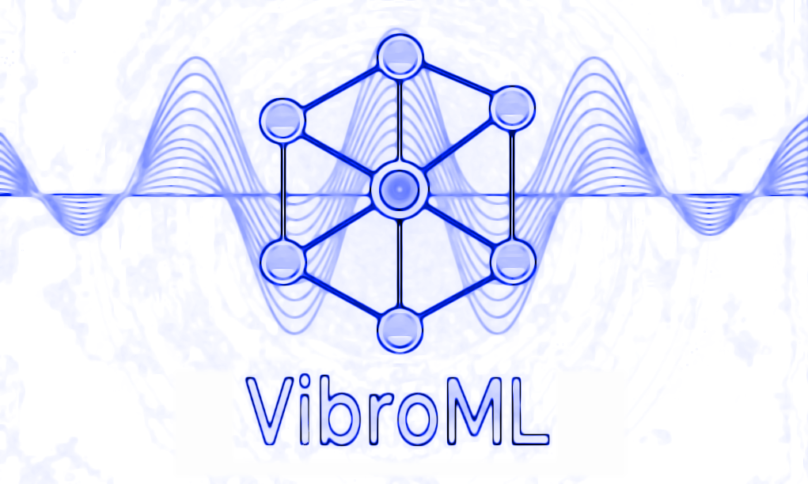

### VibroML
<div align="center">  
  
</div>


[](https://pypi.org/project/vibroml/) [](LICENSE)

### Overview

VibroML is a powerful and user-friendly Python toolkit designed for efficient, Machine-Learned Interatomic Potential (MLIP)-driven vibrational analysis of crystalline materials. It streamlines the process of identifying and stabilizing dynamically unstable phases, making it an invaluable tool for materials discovery and design. By leveraging state-of-the-art MLIPs like MACE, VibroML significantly reduces manual intervention, accelerating the discovery of novel, dynamically stable material phases.

### Key Capabilities

VibroML provides an end-to-end workflow to:

*   **Compute Phonon Band Structures & Density of States (DOS):** Extracting vibrational properties.
*   **Screen for Imaginary (Negative) Modes:** Automatically detect dynamically unstable phonon modes.
*   **Automated Soft Mode Displacement & Re-optimization:** Displace atoms along unstable eigenmodes and re-optimize the structure to find lower-energy, stable configurations.
*   **Validate Dynamic Stability:** (Future) Utilize MLIP-powered Ab Initio Molecular Dynamics (AIMD) trajectories for robust stability assessment.

### Modes of Operation

VibroML offers several specialized modes to suit different analysis needs:

*   **Phonon-Only Mode:** Quickly compute phonon band structures and DOS, with detailed reporting of imaginary modes. Ideal for initial stability checks.
*   **Auto-Screen Mode:** An intelligent, automated pipeline to detect unstable modes, displace atoms along them, re-optimize the structure, and iteratively stabilize it. This mode includes a parameter sweep to find optimal calculation settings and is now enhanced with a Genetic Algorithm for exploring stable configurations.
*   **Soft-Mode Iterative Optimization:** A dedicated workflow to systematically explore stable configurations by displacing along soft modes and relaxing, iterating until stability is achieved or limits are reached.
*   **Genetic Algorithm (GA) Driven Optimization:** Integrates a Genetic Algorithm to intelligently explore the potential energy surface, generating and relaxing new structures based on the most promising candidates from previous iterations, significantly enhancing the search for stable phases.
*   **AIMD-Check Mode:** (Planned) Run short MLIP-based molecular dynamics simulations to provide dynamic stability metrics.
*   **Command-Line Interface (CLI):** Simple and intuitive CLI for high-throughput screening and integration into automated workflows.

### Installation

VibroML can be installed via `pip` or from source.

```bash
# Recommended: Via pip
pip install vibroml

# From source (for development or latest features)
git clone https://github.com/rogeriog/vibroml.git
cd VibroML
pip install -e .
```

**Prerequisites:**

*   Python 3.9+
*   For MACE engine: `pip install mace-torch`
*   Other scientific libraries (ASE, NumPy, Matplotlib, Pymatgen, Spglib) are handled by `pip install vibroml`.

### Quickstart

#### Basic Usage

To run a phonon calculation, you need a CIF file and specify the calculation engine.

```bash
vibroml --cif your_structure.cif --engine mace
```

#### 1. Phonon-Only Mode

This mode performs a single phonon calculation on your structure. It will relax the structure by default, then compute the phonon band structure and DOS, and report any imaginary modes.

```bash
# Run a phonon calculation with MACE, skipping relaxation
vibroml --cif examples/your_material.cif --engine mace --no-relax

# Run with M3GNet, using a 4x4x4 supercell and custom displacement
vibroml --cif examples/another_material.cif --engine m3gnet --supercell_n 4 --delta 0.02 --units cm-1
```

**Output:**

*   `phonon_bs_dos_*.png` and `*.svg`: Plots of the phonon band structure and DOS.
*   `band_structure_energies_*.txt`, `dos_energies_*.txt`, `k_point_distances_*.txt`, `special_k_points_*.txt`: Raw data files.
*   `special_point_analysis.json`: Detailed analysis of frequencies at high-symmetry k-points.
*   `softest_mode_displacements.txt`: Text file detailing the displacements for the most negative phonon mode.
*   `softest_mode_*.traj` and `softest_mode_*.xyz`: ASE trajectory and XYZ files visualizing the softest mode.
*   `initial_settings.json`: Records the command-line arguments used for the run.
*   `relax.traj` and `relax.xyz`: Trajectory of the relaxation process (if not `--no-relax`).
*   `*_relaxed_*.cif`: The relaxed structure CIF file.
*   `initial_symmetry_analysis.txt` and `relaxed_symmetry_analysis.txt`: Symmetry information for initial and relaxed structures.
*   `energy_info.txt`: Summary of energy changes during relaxation.
*   `*_phonon_run_summary.txt`: A comprehensive summary of the phonon run, including energy per atom, k-point path, space group, supercell size, and total atoms.

#### 2. Auto-Screen Mode

This mode automates the search for stable phases. It performs a parameter sweep over supercell sizes, displacement deltas, and force tolerances to find the best settings that minimize negative imaginary phonons. If a soft mode persists after the sweep, it automatically triggers an iterative soft mode displacement and relaxation workflow, now enhanced with a Genetic Algorithm.

```bash
# Run auto-screen with MACE
vibroml --cif examples/unstable_material.cif --engine mace --auto

# Run auto-screen with M3GNet, allowing initial relaxation
vibroml --cif examples/another_unstable.cif --engine m3gnet --auto --fmax 0.0005
```

**Output:**

In addition to the phonon-only mode outputs for each tested configuration, this mode will generate:

*   `auto_results.json`: A summary of the parameter sweep results.
*   `soft_mode_iter_*/` directories: Each iteration of the soft mode optimization will have its own folder containing:
    *   `supercell_*/`: Subdirectories for each generated supercell variant.
    *   `*_d*.cif` and `*_d*.xyz`: Displaced supercell structures.
    *   `relaxation_summary.txt`: Summary of relaxation for all displaced structures in that folder.
    *   `soft_mode_iter_*_top_structure_*_phonon_analysis/`: Phonon analysis results for the top lowest-energy relaxed structures from that iteration, including their primitive cell CIFs.
    *   `relaxation_summary_iter.txt`: A summary of relaxation results for the current GA iteration.
*   `overall_relaxation_summary.txt`: A consolidated summary of relaxation results across all GA iterations, sorted by energy.

#### 3. AIMD-Check Mode

NOT YET IMPLEMENTED. This feature will allow users to perform short MLIP-based AIMD simulations to assess the dynamic stability of structures at finite temperatures.

```python
# Example (conceptual, not yet implemented)
# vibroml --cif stable_candidate.cif --engine mace --aimd --temperature 300 --steps 1000
```

### Command-Line Interface

Use `vibroml --help` to see all available commands and options.

```bash
# General help
vibroml --help

```

### Package Structure

```
vibroml/
├── __init__.py
├── main.py                 # Main CLI entry point
├── auto_optimize.py        # Logic for auto-screening and soft mode optimization
└── utils/
    ├── __init__.py
    ├── config.py           # Configuration constants (e.g., unit conversion factors)
    ├── genetic_algorithm.py # Implements the Genetic Algorithm for structure exploration
    ├── phonon_utils.py     # Functions for phonon calculations, results processing, and soft mode analysis
    ├── plotting_utils.py   # Functions for generating phonon plots
    ├── relaxation_utils.py # Functions for structure relaxation and symmetry analysis
    └── structure_utils.py  # Functions for loading structures, initializing calculators, and generating displaced supercells
    └── utils.py            # General utility functions (e.g., cache cleaning, MACE device detection)
```

### Contributing

We welcome contributions to VibroML! Please fork the repository, make your changes, and submit a pull request with a clear description of your modifications.

### License

This project is licensed under the MIT License. See [LICENSE](LICENSE) for full text.

### Citation

If you use VibroML in your work, please cite:

```
@software{vibroml2025,
  author = {Rogerio A. Gouvea},
  title  = {{VibroML}: Machine-Learned Vibrational Analysis & Stability Toolkit},
  year   = {2025},
  url    = {https://github.com/rogeriog/vibroml}
}
```

